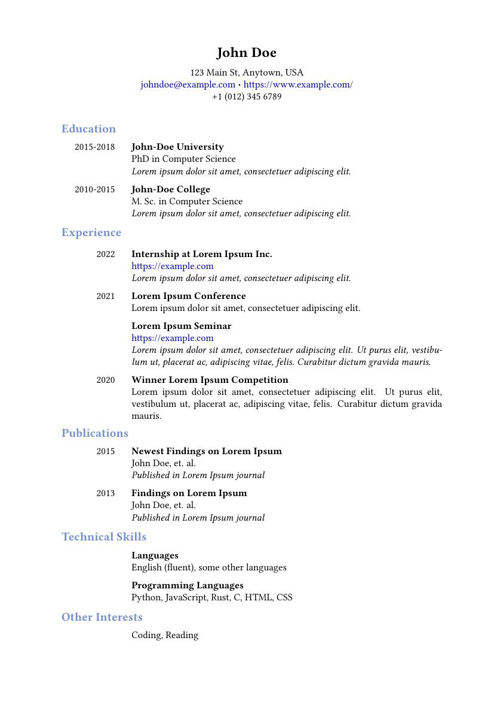
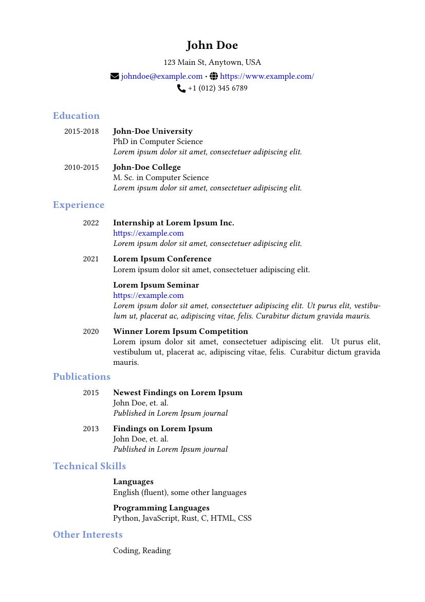

# latex-cv-template

A simple latex CV template. Inspired by [sara-venkatraman/LaTeX-Templates](https://github.com/sara-venkatraman/LaTeX-Templates)

## Table of Contents

- [Sample](#sample)
- [Getting Started](#getting-started)
  - [Prerequisites](#prerequisites)
  - [Customizing](#customizing)
- [License](#license)
- [Acknowledgments](#acknowledgments)

## Sample

<table width="100%" border="0">
    <tr>
        <td width="50%">Without Icons</td>
        <td width="50%">With Icons</td>
    </tr>
    <tr>
        <td width="50%"></td>
        <td width="50%"></td>
    </tr>
</table>

## Getting Started

### Prerequisites

A latex backend, such as [TeX Live](https://www.tug.org/texlive/), is required
to generate ouput PDFs. A detailed guide on installing LaTeX on Windows, Mac and
Linux can be found in this document from NYU:
[https://guides.nyu.edu/LaTeX/installation](https://guides.nyu.edu/LaTeX/installation)

For example, on Ubuntu installation is done using apt:

```bash
sudo apt install texlive-full
```

Similarly, on Fedora installation is done using dnf:

```bash
sudo dnf install texlive-scheme-full
```

Additionally, an editor is needed to customize the template. For VS Code users,
the extension [LaTeX Workshop](https://marketplace.visualstudio.com/items?itemName=James-Yu.latex-workshop)
greatly facilitates the editing experience by providing automatic compilation on
save, command completion, etc.

## Customizing

To create your own CV, edit [template/cv.tex](./template/cv.tex). Documentation
is provided as comments in the template document.

When changing the file structure, it is necessary to keep the latex template
file [cv.cls](./template/cv.cls) inside the same folder as your CV.

## License

This project is licensed under the MIT License - see the
[LICENSE.md](./LICENSE.md) file for details.

## Acknowledgments

- https://github.com/sara-venkatraman/LaTeX-Templates
- https://guides.nyu.edu/LaTeX/installation
